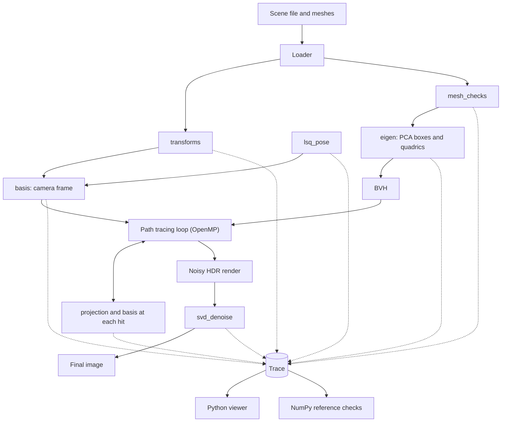

# Linear Algebra Path Tracer

a path tracer in c++ built out of linear algebra. camera frames, bounce sampling, reflections, bounding boxes, ellipsoid intersection, pose fitting and denoising all come from orthogonal matrices, projections, least squares, eigen stuff and svd. each one is its own module and each one logs what it computed.

python sits around the renderer to look inside it. it reads the logs, shows every matrix and intermediate result, and checks each module against a separate numpy version.

## what it renders

triangle meshes and quadrics (spheres, ellipsoids, planes) with diffuse, mirror and glass materials, lit by area lights and an environment. light is monte carlo path tracing with russian roulette, a bvh to keep it fast and openmp to use all the cores. the raw output is a noisy hdr image, which then goes through an svd based denoiser to get the final frame.

## how it works

a scene file describes meshes, quadrics, materials, lights and a camera. the loader turns all of it into matrices. vertices are columns of a 4xN matrix and every object and the camera gets a 4x4 transform.

the camera starts from a look direction and a rough up vector. gram-schmidt turns those into an orthonormal right, up, forward frame, and thats also where the orthogonality checks come in (QtQ = I, det = 1). the same construction runs at every surface hit to build a local frame around the normal, so bounce directions get sampled in that frame and rotated back to world space.

before rendering, mesh vertices go through a rank and degeneracy check to throw out flat or repeated triangles. pca on each mesh cluster gives an oriented bounding box and those feed the bvh. quadrics are stored as symmetric matrices and their eigen decomposition gives the axes used for ray intersection.

while rendering, every hit is basically a projection. reflection is a projection onto the normal, diffuse shading is the light direction projected onto the normal, shadow tests project onto the light direction, and the image plane is an orthogonal projection onto the camera frame.

on the side theres a least squares module that recovers a camera or object pose from noisy 2d to 3d point pairs, so the camera can be set from measurements.

the finished render is one matrix per colour channel. a truncated svd keeps the big singular values and drops the noisy tail, and then we compare that against a render that just used more samples for the same cost.

## stages

every linear algebra step is a stage with the same shape. takes inputs, returns outputs and checks, writes everything to the trace.

| stage | linear algebra | what it does in the renderer |
|---|---|---|
| `transforms` | matrix representation, orthogonal matrices | object and camera transforms, QtQ and det checks, compared against scale and shear |
| `basis` | gram-schmidt, orthonormal bases | camera frame, local frame at each hit for bounce sampling |
| `projection` | orthogonal projection | reflection, shading, shadows, image plane |
| `mesh_checks` | rank, independence, basis selection | drops degenerate triangles and redundant vertices |
| `eigen` | eigenvalues, eigenvectors, symmetric diagonalization | pca bounding boxes, ellipsoid intersection |
| `lsq_pose` | least squares | camera and object pose from noisy points |
| `svd_denoise` | svd, low rank approximation | denoises the monte carlo output |

## architecture



## the trace

each stage writes a record with the stage name, item name, shape, data and a short note, plus any checks it ran like `QtQ_is_identity: true`. small matrices go in json, big arrays go in a binary file next to it. stages are deterministic for a given seed so the reference checks are repeatable.

the viewer reads the trace and walks through the stages in order with matrices, plots and before/after images. the reference checks redo each stage in numpy and compare against whats in the trace.

## where the code lives

```
core/       renderer: rays, shapes, bvh, materials, path tracer, openmp
stages/     one file per stage, eigen only, no renderer types
trace/      trace writer (c++) and reader (python)
viewer/     python: inspection, plots, comparisons
prep/       python: mesh_checks and eigen preprocessing (see docs/prep.md)
tests/      numpy reference for each stage
scenes/     scene files and meshes
docs/       one short note per stage: concept, purpose, outcome
```

## conventions

column vectors, right-handed coordinates, y up. doubles inside stages, floats in the render loop. stage names are `stage_<name>`, one file each. full list goes in `docs/CONVENTIONS.md`.
